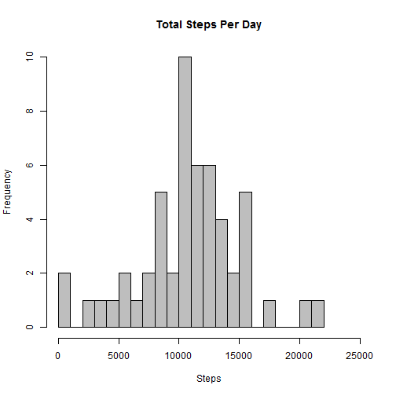
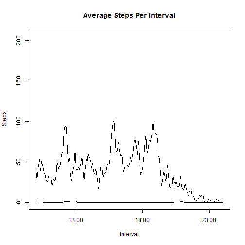
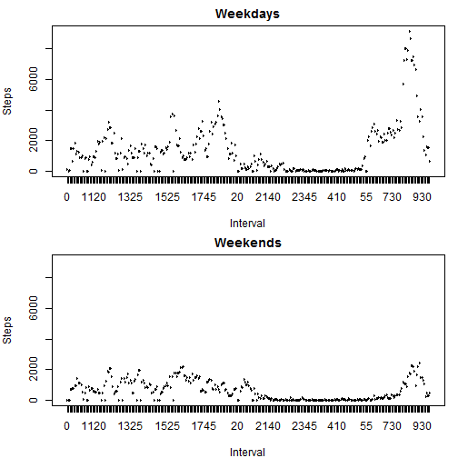

### The purpose of these analyses is to evaluate activity measured by the number of steps taken per day over 5-minute intervals
###One analysis will evaluate if there are differences in the activity between week days and weekends

## Draw a histogram of the total number of steps per day

```r
library(knitr)
setwd("C:/MyDocuments/Coursera/Data Science/Course 5 Reproducible Research/Week 2/Assign")

fulldata <- read.csv("activity.csv")

#Ignore all the NA values

nona <- na.omit(fulldata) 
nona$date <- factor(nona$date)

#Calculate the total number of steps per day
totsteps <- tapply(nona$steps,nona$date,sum,na.rm=TRUE)
totsteps <- data.frame(date=names(totsteps),steps=totsteps)
#Draw a histogram of the total number of steps per day
#plot(totsteps$date,totsteps$steps, main="Total Steps Per Day", type="h",xlab="Date",ylab="Steps")
hist(totsteps$steps, col = "grey",breaks = 16,ylim = c(0,10),xlim = c(0,25000)
                                        ,xlab = "Steps", main = "Total Steps Per Day")
```



```r
#Calculate the mean number of steps taken per day
stepsmean <- format(mean(totsteps$steps,na.rm=TRUE),digits=9)
#Calculate the median number of steps taken per day
stepsmedian <- format(median(totsteps$steps,na.rm=TRUE),digits=9)
```

## Mean and Median
The mean is 10766.1887, and the median is 10765.

## Steps per Interval

```r
#Calculate the mean steps per interval
avgsteps <- tapply(nona$steps,nona$interval,mean,na.rm=TRUE)
avgsteps <- data.frame(intervals=names(avgsteps),values=avgsteps)
avgsteps$intervals <- strptime(avgsteps$intervals,"%H%M")

#Draw the average steps per interval on a time series plot
plot(avgsteps$intervals,avgsteps$values, main="Average Steps Per Interval", type="l",xlab="Interval",ylab="Steps")
```



```r
#Determine which interval contains the highest number of steps
moststeps <- row.names(avgsteps)[which(avgsteps$values==max(avgsteps$values))]
```

The most number of step occurs in interval 835

## NA Values

```r
#Calculate the total number of missing values in the original data
numna <- nrow(fulldata[fulldata$steps=="NA",])
```

There are 2304 rows with NA values


```r
#Replace NA values with the average of the interval
for (i in 1:(nrow(fulldata))) {
    if (is.na(fulldata$steps[i])) 
    {
        fulldata$steps[i] <- avgsteps$values[match(fulldata$interval[i], avgsteps$interval)]
        ##print(paste(i,fillna$steps[i],sep=" "))
    }
}
```

```r
#Calculate the total number of steps per day
totsteps2 <- tapply(fulldata$steps,fulldata$date,sum,na.rm=TRUE)
totsteps2 <- data.frame(date=names(totsteps2),steps=totsteps2)

#Draw a histogram of the total number of steps per day
plot(totsteps2$date,totsteps2$steps, main="Total Steps Per Day NA`s replaced", type="h",xlab="Interval",ylab="Steps")
```


```r
#Calculate the mean number of steps taken per day
stepsmean2 <- format(mean(totsteps2$steps,na.rm=TRUE),digits=9)
#Calculate the median number of steps taken per day
stepsmedian2 <- format(median(totsteps2$steps,na.rm=TRUE),digits=9)
```

## Mean and Median (NA values removed)
With no NA values, the mean is 9354.22951, and the median is 10395.

Both the mean and median have increased when the NA values were replaced by the average per interval

## Weekday vs Weekend Analysis

```r
#Create a new factor variable to indicate if the date is a WEEKDAY or WEEKEND
for (i in 1:(nrow(fulldata))) {
if (weekdays(as.Date(fulldata$date[i],abbreviate=FALSE)) == 'Saturday' | weekdays(as.Date(fulldata$date[i],abbreviate=FALSE)) == 'Sunday') 
{
fulldata$week[i] <- 'WEEKEND'
#print(paste(i,fulldata$week[i],sep=" "))
}
else 
{
fulldata$week[i] <- 'WEEKDAY'
}
}

#Split the dataset into 2 seperate datasets to plot WEEKDAY and WEEKEND on seperate plots
weekdata <- subset(fulldata,fulldata$week == "WEEKDAY")
weekenddata <- subset(fulldata,fulldata$week == "WEEKEND")

totweekdata <- tapply(weekdata$steps,weekdata$interval,sum,na.rm=TRUE)
totweekdata <- data.frame(interval=names(totweekdata),steps=totweekdata)

totweekenddata <- tapply(weekenddata$steps,weekenddata$interval,sum,na.rm=TRUE)
totweekenddata <- data.frame(interval=names(totweekenddata),steps=totweekenddata)

#Calculate the y-axis range
rng <- range(totweekdata$steps,totweekenddata$steps)

par(mfrow=c(2,1), mar=c(4,4,2,1)) # set to disply plot in 2 rows with 1 colmn and adjust margins
plot(totweekdata$interval, totweekdata$steps,type="l", main="Weekdays", ylim=rng,xlab="Interval",ylab="Steps")
plot(totweekenddata$interval, totweekenddata$steps,type="l", main="Weekends", ylim=rng,xlab="Interval",ylab="Steps")
```


